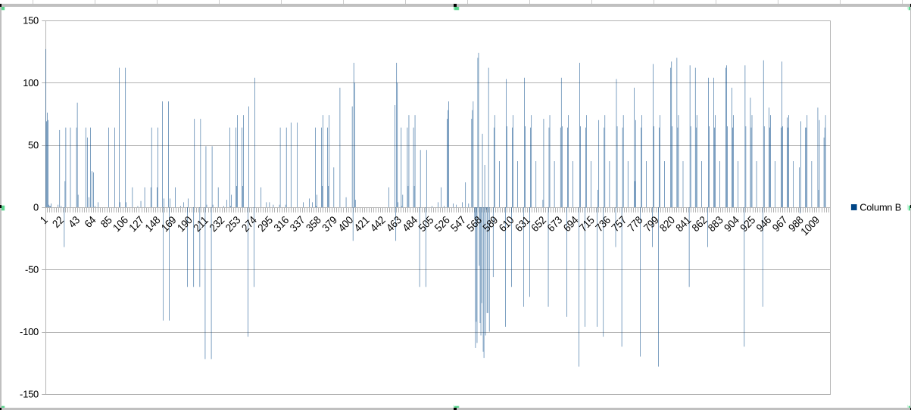
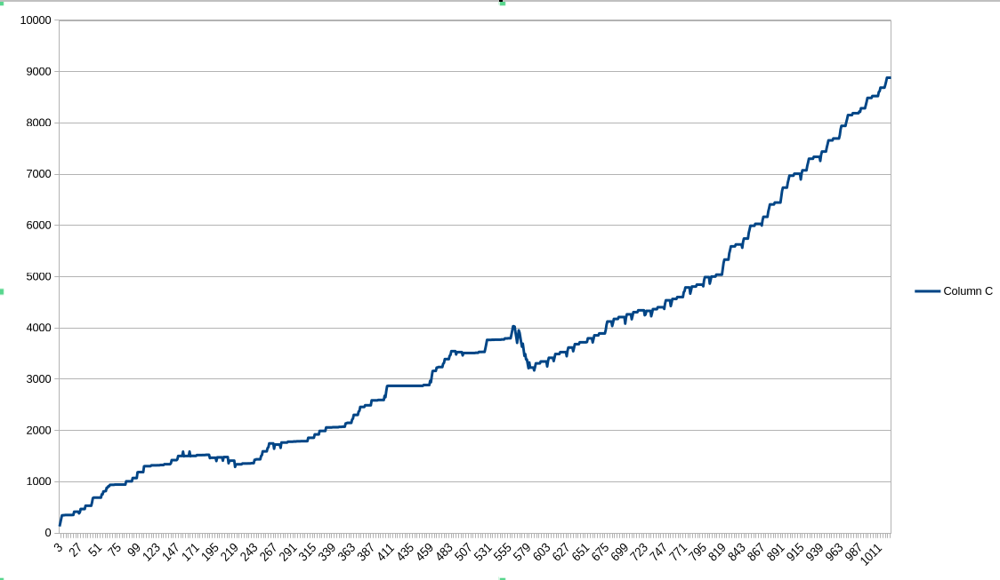

## 1. Attempt to execute
``` commandline
~/$ chmod +x ./a
~/$ ./a
Segmentation fault.
```

## 2. Install IDA Disssasembler and perform step by step trace
* Suspicious `./pesho` string is found. Try creating a file `./pesho`, then a `./pesho` directory - nothing changes.
* Rename executable to `./pesho` as this string is very close to beginning of execution. Got output change:
```commandline
~/$ cp ./ ./pesho
~/$ ./pesho
0 127
1 69
2 76
3 70
4 2
5 1
6 1
...
```
* Output stays the same after multiple executions it seems to be produced by `printf("%d %d/n")` as the `%d %d/n` string is visible in the disassembly.
* Data looks static, not runtime computed.
## 3. Focus on the output
* The first column is **monotonically increasing** so examining the output by plotting it (with LibreOffice Calc). The result looks like meaningful graph:

* As it **resembles first derivative** of some trend (acceleration) - we will **attempt to integrate** it:

## 4. Conclusion
By making an **"informed guess"** it looks like an increasing trend of some sort. Could be number of clients of a company, increasing revenue, total data served or etc. 
